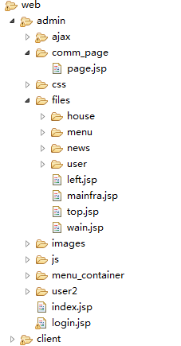
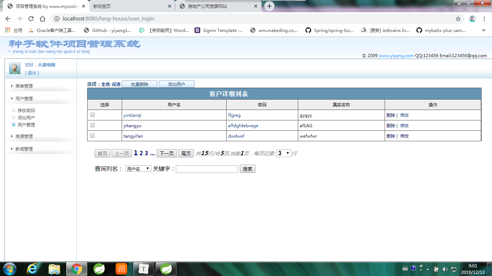

# 房地产系统项目

## 1.数据库设计

```sql

create table menu(					--菜单表
  menuid   number(8) primary key,	--menuid :  菜单编号，主键
  menu_name varchar2(50),			--menu_name : 菜单名字
  parentid number(8),				--parentid : 父菜单的编号
  picpath varchar2(100),			--picpath: 菜单的图片路径
  menu_status varchar2(10),			--menu_status :菜单状态
  menu_url varchar2(255)			--menu_url    :网页地址
);
create table news(--新闻表
  newid   number(8) primary key,	--newid : 新闻编号，主键
  title   varchar2(100),			--title : 新闻标题
  content_url varchar2(255),		--content_url : 新闻内容的路径
  publish_time date,				--publish_time ： 发布时间
  picpath  varchar2(100),			--picpath : 新闻图片路径
  menuid  number(8),				--menuid : 新闻的分类，需要与菜单表关联
  summary varchar2(500),			--summary : 新闻简介
  new_status varchar2(10),			--new_status : 新闻状态
  constraint news_meun_fk foreign key(menuid) references menu(menuid)create table news(
);  

create table house(					--房产项目
  houseid   number(8) primary key,	--houseid :  房产编号
  title   varchar2(100),			--title : 标题
  picpath  varchar2(100),			--picpath : 图片路径
  summary varchar2(500),			--summary :房产简介
  content_url varchar2(255),		--content_url : 内容路径
  menuid  number(8),				--menuid : 所属类型的编号
  house_status varchar2(10),create table house(
  constraint house_menu_fk foreign key(menuid) references menu(menuid)  houseid   number(8) primary key,
); 

--用户表
create table t_users(
  userid number(8) primary key,
  loginname varchar2(50),
  loginpwd  varchar2(50),
  realname  varchar2(50)
);
CREATE sequence  users_seq start WITH 1110 increment BY 20;
CREATE sequence  menu_seq start WITH 1110 increment BY 1;
CREATE sequence  news_seq start WITH 2220 increment BY 20;
CREATE sequence  house_seq start WITH 3330 increment BY 20;
```


## 2.项目搭建

### 1.集成环境

> ### STS+window10+tomcat7+ Oracle


### 2.工程结构





## 

## 3.网站前台


## 4.网站后台

### 1.过滤器

```java
package com.fanghouse.filter;

import java.io.IOException;
import javax.servlet.Filter;
import javax.servlet.FilterChain;
import javax.servlet.FilterConfig;
import javax.servlet.ServletException;
import javax.servlet.ServletRequest;
import javax.servlet.ServletResponse;
import javax.servlet.http.HttpServletRequest;
import javax.servlet.http.HttpServletResponse;


public class MyServletFilter implements Filter {


	public void destroy() {
		System.out.println("服务器已断开连接.....");
	}

	//进入主页
	private String []mappings={
			"findAll","findPageAll",
			"code","ent/firstpage/",
			"_nav","ById",".css",
			"first.",".js",".png",
			".jpg",".jpeg","lient/e/css"
			};

	public boolean checkContains(String mapping){
		if(mapping==null||mapping.equals("")){
			return false;
		}
		for(String i:mappings){
			if(mapping.contains(i)){
				return true;
			}
			
		}
		return false;
	}
	
	@SuppressWarnings("unused")
	public void doFilter(ServletRequest request, ServletResponse response, FilterChain chain) throws IOException, ServletException {
		HttpServletRequest req=(HttpServletRequest) request;
		HttpServletResponse rsp=(HttpServletResponse) response;
		String serverpath=req.getServletPath();
		System.out.println("serverpath: "+ serverpath);
		System.out.println();
		
		if(checkContains(serverpath)){
			chain.doFilter(request, response);
		}
		
	
		Object user=req.getSession().getAttribute("u");
		if(user==null){
			req.getRequestDispatcher("/menu_nav").forward(request, response);
		}else{
			chain.doFilter(request, response);
		}
		
		chain.doFilter(request, response);
	}


	public void init(FilterConfig fConfig) throws ServletException {
		System.out.println("服务器已连接,正在初始化配置....");
	}

}


```


### 2. web.xml

```xml
<?xml version="1.0" encoding="UTF-8"?>
<web-app xmlns:xsi="http://www.w3.org/2001/XMLSchema-instance" xmlns="http://java.sun.com/xml/ns/javaee" xsi:schemaLocation="http://java.sun.com/xml/ns/javaee http://java.sun.com/xml/ns/javaee/web-app_2_5.xsd" id="WebApp_ID" version="2.5">
  <display-name>fang-house</display-name>
  <welcome-file-list>
    <welcome-file>menu_nav</welcome-file>
  </welcome-file-list>
  <filter>
    <filter-name>MyServletFilter</filter-name>
    <filter-class>com.fanghouse.filter.MyServletFilter</filter-class>
  </filter>
  <filter-mapping>
    <filter-name>MyServletFilter</filter-name>
    <url-pattern>/*</url-pattern>
  </filter-mapping>
  <servlet>
    <servlet-name>HouseServlet</servlet-name>
    <servlet-class>com.fanghouse.servlet.HouseServlet</servlet-class>
  </servlet>
  <servlet-mapping>
    <servlet-name>HouseServlet</servlet-name>
    <url-pattern>/house_findAll</url-pattern>
    <url-pattern>/house_findById</url-pattern>
    <url-pattern>/house_save</url-pattern>
    <url-pattern>/house_updateById</url-pattern>
    <url-pattern>/house_ids</url-pattern>
    <url-pattern>/house_delete</url-pattern>
    <url-pattern>/house_page</url-pattern>
  </servlet-mapping>
  <servlet>
    <servlet-name>MenuServlet</servlet-name>
    <servlet-class>com.fanghouse.servlet.MenuServlet</servlet-class>
  </servlet>
  <servlet-mapping>
    <servlet-name>MenuServlet</servlet-name>
    <url-pattern>/menu_nav</url-pattern>
    <url-pattern>/menu_findAll</url-pattern>
    <url-pattern>/menu_findById</url-pattern>
    <url-pattern>/menu_parentlist</url-pattern>
    <url-pattern>/menu_save</url-pattern>
    <url-pattern>/menu_updateById</url-pattern>
    <url-pattern>/menu_ids</url-pattern>
    <url-pattern>/menu_delete</url-pattern>
    <url-pattern>/menu_page</url-pattern>
    <url-pattern>/menu_sub</url-pattern>
    
    
  </servlet-mapping>
  <servlet>
    <servlet-name>NewsServlet</servlet-name>
    <servlet-class>com.fanghouse.servlet.NewsServlet</servlet-class>
  </servlet>
  <servlet-mapping>
    <servlet-name>NewsServlet</servlet-name>
    <url-pattern>/news_findAll</url-pattern>
    <url-pattern>/news_findById</url-pattern>
    <url-pattern>/news_save</url-pattern>
    <url-pattern>/news_updateById</url-pattern>
    <url-pattern>/news_ids</url-pattern>
    <url-pattern>/news_delete</url-pattern>
    <url-pattern>/news_page</url-pattern>
  </servlet-mapping>
  <servlet>
    <servlet-name>UserServlet</servlet-name>
    <servlet-class>com.fanghouse.servlet.UserServlet</servlet-class>
  </servlet>
  <servlet-mapping>
    <servlet-name>UserServlet</servlet-name>
    <url-pattern>/user_findAll</url-pattern>
    <url-pattern>/user_findById</url-pattern>
    <url-pattern>/user_save</url-pattern>
    <url-pattern>/user_updateById</url-pattern>
    <url-pattern>/user_ids</url-pattern>
    <url-pattern>/user_delete</url-pattern>
    <url-pattern>/user_page</url-pattern>
  </servlet-mapping>
  <servlet>
    <servlet-name>LoginServlet</servlet-name>
    <servlet-class>com.fanghouse.servlet.LoginServlet</servlet-class>
  </servlet>
  <servlet-mapping>
    <servlet-name>LoginServlet</servlet-name>
    <url-pattern>/user_login</url-pattern>
    <url-pattern>/user_search</url-pattern>
    
    <url-pattern>/user_logout</url-pattern>
    <url-pattern>/user_reg</url-pattern>
  </servlet-mapping>
  
  <servlet>
    <servlet-name>sub_nav</servlet-name>
    <servlet-class>com.fanghouse.servlet.MenuNavServlet</servlet-class>
  </servlet>
  <servlet-mapping>
    <servlet-name>sub_nav</servlet-name>
    <url-pattern>/about_nav</url-pattern>
    <url-pattern>/news_nav</url-pattern>
    <url-pattern>/server_nav</url-pattern>
    <url-pattern>/product_nav</url-pattern>
    <url-pattern>/zhaopin_nav</url-pattern>
    <url-pattern>/contact_nav</url-pattern>               
  </servlet-mapping>
  
</web-app>
```

### 3.登录

```java
public void doPost(HttpServletRequest request, HttpServletResponse response) throws ServletException, IOException {
		request.setCharacterEncoding("utf-8");
	    response.setCharacterEncoding("utf-8");
		System.out.println("已进入LoginServlet'doGet中.....");
		String serverpath=request.getServletPath();
		System.out.println("serverpath: "+serverpath);
		String path=serverpath.substring(serverpath.indexOf("_")+1);
		System.out.println("path: "+path);	
		if(path.equals(LOGIN)){
			String code1=(String) request.getSession().getAttribute("checkcode");
			request.getSession().setAttribute("checkcode","");
			String code2=request.getParameter("code");
			String username=request.getParameter("username");
			String password=request.getParameter("password");
			Map map=service.login(username, password);
			System.out.println(code1+code2+(code1.equals(code2)));
			Integer status=(Integer) map.get("status");
			if(!code1.equals(code2)){
				status=406;
			}

			if(status==200){
				request.getSession().setAttribute("u",(User)map.get("user"));
				request.getRequestDispatcher("admin/index.jsp").forward(request, response);
			}if(status==406){
				request.setAttribute("msg","验证码错误");
				request.getRequestDispatcher("admin/login.jsp").forward(request, response);
			}else{
				request.setAttribute("msg","登录失败！");
				request.getRequestDispatcher("admin/login.jsp").forward(request, response);
			}
			
		}else if(path.equals(LOGOUT)){
			request.getSession().removeAttribute("u");
			request.getRequestDispatcher("admin/login.jsp").forward(request, response);
		}
	}


```


### 4.菜单管理


### 5.用户管理





### 6.房产管理


### 7.新闻管理


